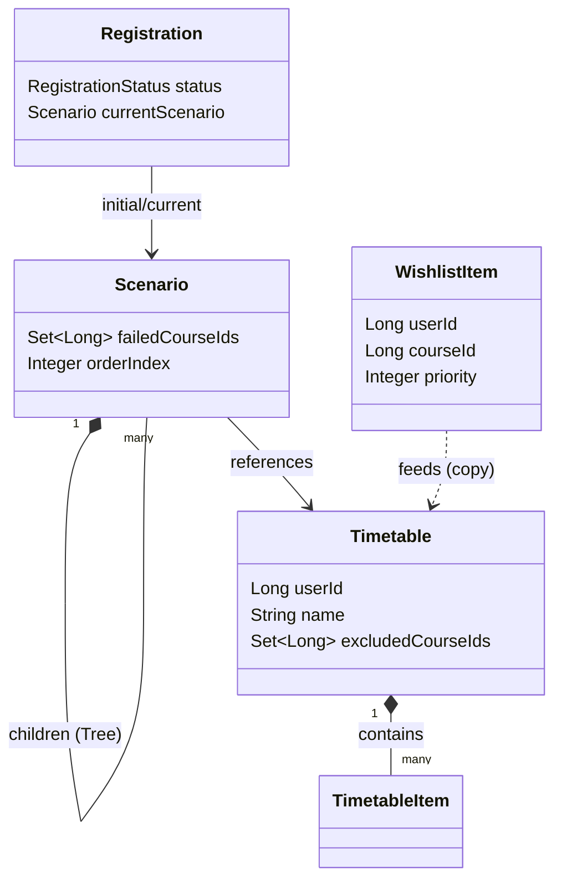

# Architecture

UniPlan의 시스템 아키텍처, API 설계, 엔티티 구조를 설명합니다.

---

## 프론트엔드 아키텍처 (Frontend Architecture)

### 핵심 아키텍처 (Core Architecture)
- **Next.js App Router**: 하이브리드 렌더링 (SSR/CSR) 구조를 채택했습니다.
- **서버 상태 관리 (Server State Management)**: `React Query`를 주 데이터 저장소로 사용하여 백엔드 상태와 동기화합니다.
- **타입 안정성 (Type Safety)**: OpenAPI 스키마에서 자동 생성된 TypeScript 타입을 사용하여 API 계약을 준수합니다.

### 컴포넌트 계층 (Component Hierarchy)
- **`app/` (Pages)**: 하이드레이션(Hydration) 경계, 레이아웃 구성, URL 상태 동기화를 담당합니다.
- **`components/` (Business)**: 도메인 로직이 포함된 비즈니스 컴포넌트 (예: `TimetableGrid`, `ScenarioBuilder`)입니다.
- **`components/ui/` (Design System)**: shadcn/ui 기반의 재사용 가능한 순수(Dumb) 컴포넌트입니다.

### 상태 전략 (State Strategy)
- **URL 주도 상태 (URL-Driven State)**: 학기 컨텍스트, 선택된 시나리오 등 주요 애플리케이션 상태는 URL 쿼리 파라미터에 반영하여 공유 가능하게 만듭니다.
- **Context API**: 전역 설정(테마, 대학 컨텍스트 등)에만 제한적으로 사용합니다.

---


### 경로 변환 규칙

**핵심 원칙**: "마이크로서비스는 Gateway의 라우팅 규칙을 모른다"

```
클라이언트: /api/v1/users/me
    ↓
API Gateway: RewritePath 적용
    ↓
내부 서비스: /users/me
```

### 서비스별 라우팅

| 외부 경로 (클라이언트) | 내부 경로 (서비스) | 서비스 |
|---------------------|------------------|--------|
| `/api/v1/auth/**` | `/auth/**` | user-service |
| `/api/v1/users/**` | `/users/**` | user-service |
| `/api/v1/universities/**` | `/universities/**` | user-service |
| `/api/v1/timetables/**` | `/timetables/**` | planner-service |
| `/api/v1/scenarios/**` | `/scenarios/**` | planner-service |
| `/api/v1/wishlist/**` | `/wishlist/**` | planner-service |
| `/api/v1/registrations/**` | `/registrations/**` | planner-service |
| `/api/v1/courses/**` | `/courses/**` | catalog-service |

### Gateway 설정 예시

```yaml
# api-gateway/application-local.yml
routes:
  - id: user-service
    uri: http://localhost:8081
    predicates:
      - Path=/api/v1/auth/**, /api/v1/users/**
    filters:
      - RewritePath=/api/v1/(?<segment>.*), /$\{segment}
```

### Controller 매핑 규칙

```java
// ❌ 잘못된 매핑 (Gateway가 이미 /api/v1 제거함)
@RequestMapping("/api/v1/users")

// ✅ 올바른 매핑
@RequestMapping("/users")
```

> Implementation details (Routing Config, Controller Mapping) are available in [Backend Guide](guides/backend.md#4-api--gateway-integration).

### JWT 인증 흐름

```
1. 클라이언트 요청
   GET /api/v1/users/me
   Authorization: Bearer {token}

2. Gateway
   - JWT 검증
   - X-User-Id, X-User-Email, X-User-Role 헤더 추가
   - 경로 변환: /api/v1/users/me → /users/me

3. User Service
   GET /users/me
   X-User-Id: 123

4. 응답
   200 OK { id: 123, email: "...", ... }
```

**인증 예외 경로**: `/api/v1/auth/**` (로그인/회원가입)

---

## 설정 아키텍처 (Configuration Architecture)

Spring 내부에서는 프로파일 분리를 하지 않고(local 제외), Docker Compose에서 환경변수를 중앙 관리합니다.

### Spring Profile 구조

| 파일 | 용도 |
|------|------|
| `application.yml` | 플레이스홀더만 포함 (`${DB_URL}`, `${JWT_SECRET}` 등) |
| `application-local.yml` | 로컬 개별 실행용 (`bootRun`, IDE) |

### Docker Compose 환경 구분

| 파일 | 용도 |
|------|------|
| `docker-compose.yml` | 개발 환경 |
| `docker-compose.test.yml` | Integration 테스트 환경 |
| `docker-compose.prod.yml` | 운영 환경 (`.env`로 시크릿 주입) |

> 상세 배경은 [ADR-004](adr/004-centralized-config.md) 참조.

---

## Internal Service Communication

### 서비스 간 통신 (East-West)

Planner Service가 Catalog Service의 강의 정보를 조회할 때 사용하는 내부 통신 구조입니다.

```
Planner Service  ─────────────────────────>  Catalog Service
                   OpenFeign (HTTP/REST)
                   /internal/courses?ids=1,2,3
```

### 구성 요소

| 컴포넌트 | 설명 |
|----------|------|
| `CatalogFeignClient` | OpenFeign 선언적 HTTP 클라이언트 인터페이스 |
| `CatalogClient` | 비즈니스 로직용 Facade (Feign 클라이언트 래핑) |
| `InternalCourseController` | Catalog Service의 내부 전용 API 컨트롤러 |


> Implementation details (Internal Controllers, Feign Clients) are available in [Backend Guide](guides/backend.md#5-internal-communication-msa).


### Batch API

다수의 강의를 효율적으로 조회하기 위해 Batch API를 사용합니다.

```
GET /internal/courses?ids=1,2,3,4,5
→ 단일 요청으로 여러 강의 정보 반환
```

---

## API Specification & Code Generation

UniPlan은 **Code-First API 개발 방식**을 채택하고 있으며, 백엔드 코드를 **Single Source of Truth**로 하여 클라이언트 및 테스트 코드를 자동 생성합니다.

### Workflow

```mermaid
graph TD
    subgraph Backend [Backend (Spring Boot)]
        Controller[Controller / DTO]
        Swagger[SpringDoc OpenAPI]
        Controller --> Swagger
    end

    subgraph Spec [OpenAPI Specification]
        JSON[OpenAPI JSON (/v3/api-docs)]
        Swagger --> JSON
    end

    subgraph Frontend [Frontend (Next.js)]
        TS[openapi-typescript]
        Types[TypeScript Interfaces]
        JSON --> TS --> Types
    end

    subgraph Test [Integration Tests (Python)]
        CG[datamodel-code-generator]
        Pydantic[Pydantic Models]
        JSON --> CG --> Pydantic
    end
```

### Swagger Documentation

#### 구조
```
backend/
├── api-gateway/              ← Swagger (통합) ✅
│   ├── Port: 8080
│   └── URL: http://localhost:8080/swagger-ui.html
│
├── user-service/             ← Swagger (독립) ✅
│   ├── Port: 8081
│   └── URL: http://localhost:8081/swagger-ui.html
│
├── planner-service/          ← Swagger (독립) ✅
│   ├── Port: 8082
│   └── URL: http://localhost:8082/swagger-ui.html
│
└── catalog-service/          ← Swagger (독립) ✅
    ├── Port: 8083
    └── URL: http://localhost:8083/swagger-ui.html
```

#### 역할 분담
**API Gateway Swagger (통합 문서)**
- 목적: 프론트엔드 개발자를 위한 원스톱 문서
- 특징: 서비스별 그룹화, 통합 JWT 인증, Try it out 기능

**개별 서비스 Swagger (독립 문서)**
- 목적: 백엔드 개발자를 위한 서비스별 상세 문서
- 특징: 단일 책임, 빠른 로딩, 독립 배포

> Implementation details (Dependencies, Swagger Grouping) are available in [Backend Guide](guides/backend.md#4-api--gateway-integration).


---

## Planner Service Entity Design

### 아키텍처 개요

**Mermaid Entity Relationship Diagram:**


### Key Components

1.  **WishlistItem (희망과목)**: 사용자가 담아둔 우선순위 기반 과목 목록.
2.  **Timetable (시간표)**: 특정 학기의 기본 수강 계획. 제외할 과목(excludedCourseIds)을 관리하여 조합을 생성합니다.
3.  **Scenario (의사결정 트리)**: "만약 A과목 실패 시 B안으로"와 같은 조건부 계획. 트리 구조로 계층적 대안을 표현합니다.
4.  **Registration (수강신청)**: 실제 수강신청 프로세스의 상태를 추적하고, 시나리오 트리를 따라 자동으로 진행(Navigation)합니다.

> Detailed code examples are available in [Backend Guide](guides/backend.md#6-domain-implementation-examples).

### 설계 장점

1.  **관심사 분리**: Wishlist(희망) → Timetable(조합) → Scenario(로직) → Registration(실행)
2.  **트리 기반 대안 관리**: 단순 1차원 목록이 아닌, 상황별 분기 처리가 가능한 시나리오 구조
3.  **자동 네비게이션**: 수강신청 실패 시 사전에 정의된 트리 경로를 따라 다음 대안으로 자동 전환


---

## University (대학) 구조

### 멀티 대학 지원

UniPlan은 여러 대학을 지원하도록 설계되어 있습니다. 각 대학은 고유한 강의 데이터를 가지며, 사용자는 가입 시 대학을 선택합니다.

### 엔티티 구조

```java
// user-service
@Entity
@Table(name = "university")
class University {
    Long id;
    String name;     // 대학 이름 (예: "경희대학교")
    String code;     // 대학 코드 (예: "KHU")
    LocalDateTime createdAt;
}

// User와 University 관계
@Entity
@Table(name = "users")
class User {
    // ...
    @ManyToOne
    University university;  // 사용자 소속 대학
}

// catalog-service
@Entity
@Table(name = "course")
class Course {
    // ...
    @ManyToOne
    University university;  // 강의 제공 대학
}
```

### API

```
GET /api/v1/universities         # 대학 목록 조회 (인증 불필요)

# 강의 검색 시 대학 필터링
GET /api/v1/courses?universityId=1&openingYear=2025&semester=1
```

### 학기 컨텍스트

프론트엔드에서 학기 선택 시 localStorage에 저장되며, 강의 검색 등에 자동으로 적용됩니다.

```typescript
interface SemesterContext {
  openingYear: number;  // 개설 연도 (예: 2025)
  semester: string;     // 학기 (예: "1" 또는 "2")
}
```

### 크롤러 설정

각 대학별 크롤러는 `scripts/crawler/config/` 디렉토리에 설정됩니다.

```python
# scripts/crawler/config/khu_config.py
UNIVERSITY_ID = 1        # DB의 University ID
UNIVERSITY_CODE = "KHU"
UNIVERSITY_NAME = "경희대학교"
```

변환된 강의 데이터에는 `universityId`가 포함됩니다.